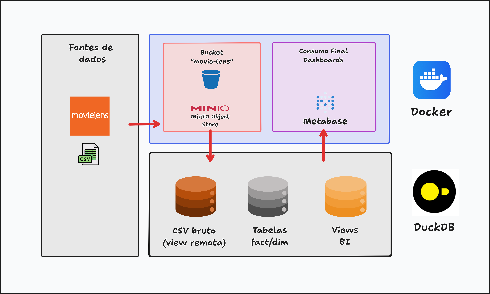
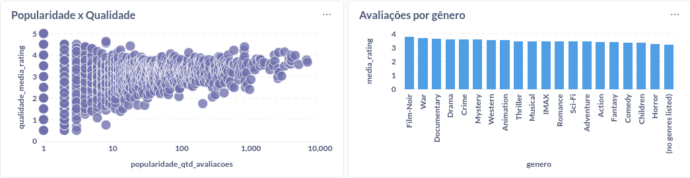
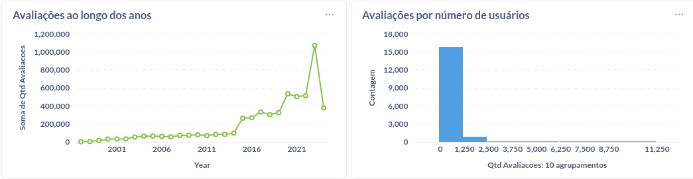
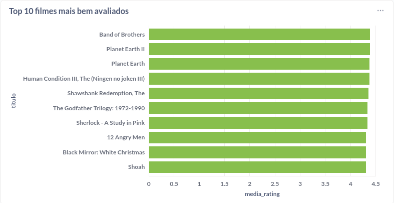
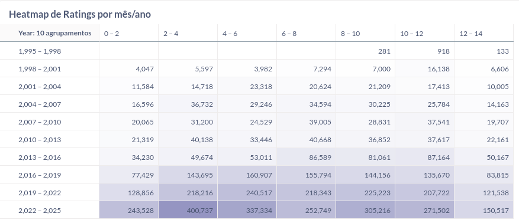

# Desafio técnico 01 — Case real com BigQuery e Metabase (com adaptações)

## **Cloud / Data**

- **MinIO**

Armazenamento dos arquivos CSV (camada raw).

- **DuckDB**

External tables, modelagem analítica, queries SQL e criação de views.

## **BI / Visualização**

- **Metabase**

Ferramenta de Business Intelligence para criação de gráficos e dashboards.

## **Infraestrutura local**

- **Docker**

Utilizado para subir o Metabase, DuckDB e MinIO localmente.

## **Linguagem**

- **SQL (DuckDB)**

Utilizado para:

1. limpeza de dados
2. modelagem analítica
3. criação de tabelas
4. criação de views
5. métricas do dashboard

---
## Arquitetura do Pipeline



--- 
## Decisões técnicas

- No desafio original, pedia o uso de ferramentas do GCP, como o Cloud Storage e o BigQuery e eu adaptei para usar o MinIO junto com o DuckDB para conseguir produzir um resultado semelhante, e montei um arquivo docker-compose para subir três instâncias.
- A principal motivação foi conseguir fazer o mesmo desafio com o uso de ferramentas open-source / gratuitas em caso de não conseguir cumprir o desafio usando o free tier do GCP
- Cheguei a começar a implementar o projeto usando PostgreSQL ao invés do DuckDB, mas para o que eu precisava, usar o PostgreSQL não era fiel a infraestrutura original nem eficiente para obter os dados remotamente
- O único empecilho que eu achei foi no uso conjunto do DuckDB com o Metabase: o banco só pode ser acessado ou pelo Metabase ou pelo CLI/interface, e não os dois ao mesmo tempo, o que é uma limitação conhecida para quem tem que usar Metabase com DuckDB

## Passo a passo

### Camada Bronze

1. Uma vez que subi os contâiners, eu fiz log-in na interface web do MinIO e criei um bucket em `Create Bucket` com o nome `movie-lens`, e criei uma pasta com o nome "raw" no bucket, onde subi os arquivos csv

2. Para conseguir acessar o MinIO pela linha de comando, eu utilizei o seguinte comando no terminal, ao acessar o contâiner do MinIO via bash:

```bash
mc alias set myminio http://localhost:9000 minioadmin minioadmin123
```

3. Criei o /data/analytics.duckdb instalei e carreguei o `httpfs`, configurando as variáveis do MinIO, e ativei sua interface usando os comandos abaixo:

```bash
duckdb /data/analytics.duckdb -ui
```

```bash
INSTALL httpfs; LOAD httpfs;

SET s3_endpoint = 'localhost:9000';
SET s3_access_key_id = 'minioadmin';
SET s3_secret_access_key = 'minioadmin123';
SET s3_use_ssl = false;
SET s3_url_style='path';
```

- Também criei schemas para organizar melhor o banco:

```bash
CREATE SCHEMA IF NOT EXISTS bronze;
CREATE SCHEMA IF NOT EXISTS silver;
CREATE SCHEMA IF NOT EXISTS gold;
```

4. Para importar os dados e criar o equivalente às external tables do GCS e definir os tipos todos como VARCHAR, eu rodei a query:

```bash
CREATE OR REPLACE VIEW raw.elicitations AS SELECT * FROM read_csv(
  's3://movie-lens/raw/movie_elicitation_set.csv',
  types = {
    'tstamp':'VARCHAR',
    'source':'VARCHAR',
    'month_idx':'VARCHAR',
    'movieId':'VARCHAR',
  }
);
```

- Verifiquei com o comando

```bash
SELECT * FROM raw.elicitations LIMIT 5;

┌─────────┬───────────┬─────────┬─────────────────────┐
│ movieId │ month_idx │ source  │       tstamp        │
│ varchar │  varchar  │ varchar │       varchar       │
├─────────┼───────────┼─────────┼─────────────────────┤
│ 1       │ 0         │ 1       │ 2023-02-27 19:30:03 │
│ 1       │ 1         │ 1       │ 2023-04-01 00:01:47 │
│ 1       │ 2         │ 1       │ 2023-05-01 00:02:01 │
│ 1       │ 3         │ 1       │ 2023-06-01 00:01:40 │
│ 1       │ 4         │ 1       │ 2023-07-01 00:01:56 │
└─────────┴───────────┴─────────┴─────────────────────┘
```

- Adaptei a query para os outros CSV's e ao final, tínhamos essas views:

```bash
SELECT view_name FROM duckdb_views;

┌────────────────────┐
│     view_name      │
│      varchar       │
├────────────────────┤
│ additional_ratings │
│ beliefs            │
│ elicitations       │
│ movies             │
│ ratings            │
│ recommendations    │
└────────────────────┘
```

### Camada Prata

5. A partir das views, eu criei as tabelas analíticas `silver.dim_movies` e `silver.fact_ratings`

- Para a `dim_movies`, meu desafio era obter o ano a partir do título para criar a coluna separada de ano de lançamento, e essa foi a consulta que eu construi:

```bash
CREATE OR REPLACE TABLE silver.dim_movies (
  titulo VARCHAR,
  generos VARCHAR,
  ano_lancamento INTEGER
);

INSERT INTO silver.dim_movies 
  SELECT
    regexp_replace(title, '\s\(\d{4}\)$', ''),
    genres,
    regexp_extract(title, '\((\d{4})\)$', 1)::INTEGER
  FROM raw.movies
  WHERE regexp_matches(title, '\(\d{4}\)$');
;
```

- Esse foi o resultado final:

```bash
SELECT * FROM silver.dim_movies LIMIT 10;

┌─────────────────────────────┬─────────────────────────────────────────────┬────────────────┐
│           titulo            │                   generos                   │ ano_lancamento │
│           varchar           │                   varchar                   │     int32      │
├─────────────────────────────┼─────────────────────────────────────────────┼────────────────┤
│ Toy Story                   │ Adventure|Animation|Children|Comedy|Fantasy │           1995 │
│ Jumanji                     │ Adventure|Children|Fantasy                  │           1995 │
│ Grumpier Old Men            │ Comedy|Romance                              │           1995 │
│ Waiting to Exhale           │ Comedy|Drama|Romance                        │           1995 │
│ Father of the Bride Part II │ Comedy                                      │           1995 │
│ Heat                        │ Action|Crime|Thriller                       │           1995 │
│ Sabrina                     │ Comedy|Romance                              │           1995 │
│ Tom and Huck                │ Adventure|Children                          │           1995 │
│ Sudden Death                │ Action                                      │           1995 │
│ GoldenEye                   │ Action|Adventure|Thriller                   │           1995 │
└─────────────────────────────┴─────────────────────────────────────────────┴────────────────┘
```

- Para a tabela de `silver.fact_ratings`, meu desafio era unificar as tabelas e fazer uma limpeza no dataset final. Ainda precisei dar uma limpada nesse dataset em específico, porque a coluna ratings deveria vir de 0.5 a 5.0, e haviam valores -1, e como esses dados só representavam 12% do total dos registros totais (somando as duas tabelas originais), não vi problema em deixá-los de fora

```bash
CREATE OR REPLACE TABLE silver.fact_ratings AS

SELECT 
  TRY_CAST(userId AS VARCHAR) AS userId,
  TRY_CAST(movieId AS VARCHAR) AS movieId,
  TRY_CAST(rating AS DOUBLE) AS rating,
  TRY_CAST(tstamp AS TIMESTAMP) AS tstamp
FROM raw.ratings
WHERE TRY_CAST(rating AS DOUBLE) IS NOT NULL
AND rating <> -1

UNION ALL

SELECT
  TRY_CAST(userId AS VARCHAR) AS userId,
  TRY_CAST(movieId AS VARCHAR) AS movieId,
  TRY_CAST(rating AS DOUBLE) AS rating,
  TRY_CAST(tstamp AS TIMESTAMP) AS tstamp
FROM raw.additional_ratings
WHERE TRY_CAST(rating AS DOUBLE) IS NOT NULL
AND rating <> -1;
```

- Esse foi o resultado final:

```bash
SELECT * FROM silver.fact_ratings LIMIT 5;

┌────────┬─────────┬────────┬─────────────────────┐
│ userId │ movieId │ rating │       tstamp        │
│ int32  │  int32  │ double │      timestamp      │
├────────┼─────────┼────────┼─────────────────────┤
│  42170 │       1 │    4.0 │ 1998-06-18 16:31:37 │
│  42170 │       7 │    4.0 │ 1998-06-18 16:31:37 │
│  42170 │      17 │    4.0 │ 1998-06-18 16:31:37 │
│  42170 │      24 │    2.0 │ 1997-11-07 13:41:17 │
│  42170 │      36 │    2.0 │ 1997-11-07 13:27:51 │
└────────┴─────────┴────────┴─────────────────────┘
```

### Camada Ouro

6. Com uma mãozinha do Claude, eu montei as queries para as views que seriam consumidas pelo metabase, como solicitado pelo desafio e montei views para cada uma:

```bash
CREATE OR REPLACE VIEW gold.vw_movie_kpis AS
SELECT
  COUNT(DISTINCT f.movieId)              AS total_filmes_avaliados,
  COUNT(DISTINCT f.userId)                AS total_usuarios,
  COUNT(*)                                  AS total_avaliacoes,
  ROUND(AVG(f.rating), 2)                   AS media_geral_rating,
  ROUND(STDDEV(f.rating), 2)                AS desvio_padrao_rating,
  MIN((f.tstamp)::timestamp)     AS primeira_avaliacao,
  MAX((f.tstamp)::timestamp)     AS ultima_avaliacao
FROM silver.fact_ratings f;

```


```bash
CREATE OR REPLACE VIEW gold.vw_scatter_popularity_vs_quality AS
SELECT
  m.movieId,
  m.titulo,
  COUNT(*)                 AS popularidade_qtd_avaliacoes,
  ROUND(AVG(f.rating), 2)  AS qualidade_media_rating
FROM silver.fact_ratings f
JOIN silver.dim_movies m ON m.movieId = f.movieId
GROUP BY m.movieId, m.titulo;
```


```bash
CREATE OR REPLACE VIEW gold.vw_top_movies AS
SELECT
  m.movieId,
  m.titulo,
  m.ano_lancamento,
  COUNT(*)                 AS qtd_avaliacoes,
  ROUND(AVG(f.rating), 2)  AS media_rating
FROM silver.fact_ratings f
JOIN silver.dim_movies m ON m.movieId = f.movieId
GROUP BY m.movieId, m.titulo, m.ano_lancamento
HAVING COUNT(*) >= 50         
ORDER BY media_rating DESC, qtd_avaliacoes DESC
LIMIT 10;
```


```bash
CREATE OR REPLACE VIEW gold.vw_ratings_heatmap AS
SELECT
    EXTRACT(year FROM tstamp::timestamp)  AS year,
    EXTRACT(month FROM tstamp::timestamp) AS month,
    COUNT(*) AS qtd_avaliacoes,
    ROUND(AVG(rating), 2) AS media_rating
FROM silver.fact_ratings
GROUP BY 1, 2;
```


```bash
CREATE OR REPLACE VIEW gold.vw_user_activity AS
SELECT
  f.userId,
  COUNT(*)                                          AS qtd_avaliacoes,
  ROUND(AVG(f.rating), 2)                           AS media_rating_dado,
  MIN(f.tstamp::timestamp)             AS primeira_avaliacao,
  MAX(f.tstamp::timestamp)             AS ultima_avaliacao
FROM silver.fact_ratings f
GROUP BY f.userId;
```


```bash
CREATE OR REPLACE VIEW gold.vw_genre_performance AS
SELECT
  genero,
  COUNT(*)                       AS qtd_avaliacoes,
  COUNT(DISTINCT f.movieId)     AS qtd_filmes,
  ROUND(AVG(f.rating), 2)        AS media_rating
FROM silver.fact_ratings f
JOIN silver.dim_movies m ON m.movieId = f.movieId
CROSS JOIN UNNEST(string_split(m.generos, '|')) AS t(genero)
GROUP BY genero
ORDER BY media_rating DESC;

SELECT * FROM gold.vw_genre_performance LIMIT 10;
```

7. Em seguida, conectei o Metabase ao banco de dados e fui criando os gráficos (com ajuda do Claude também)




